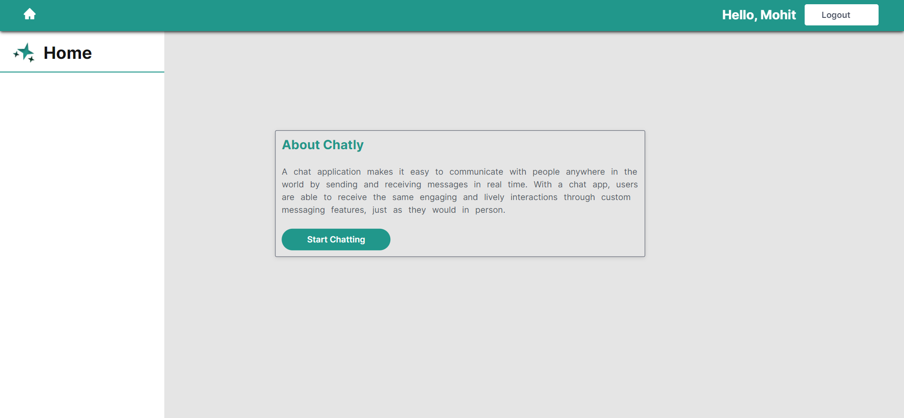
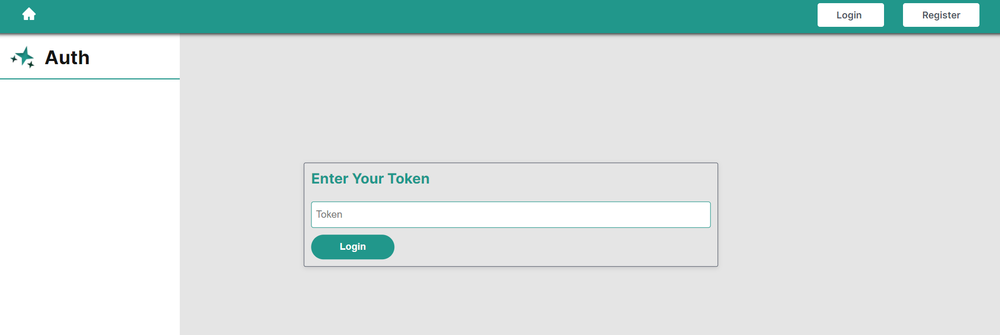
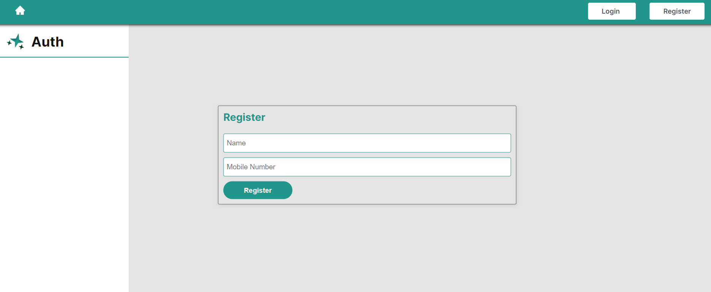
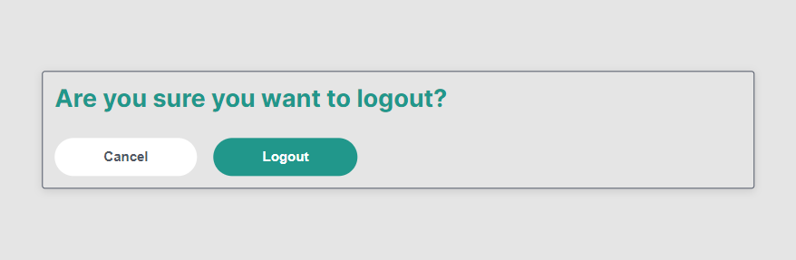
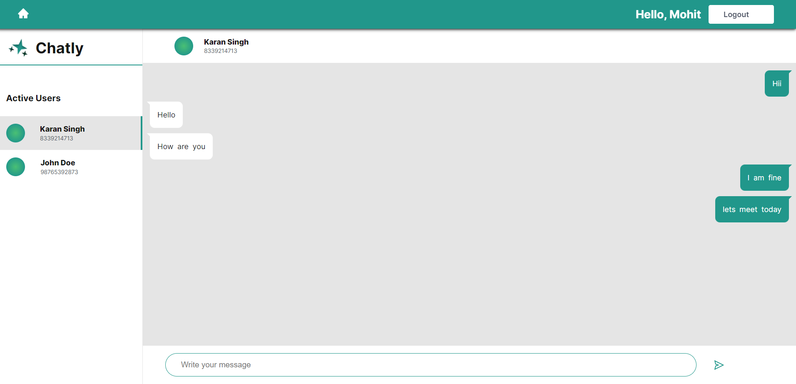

# Chatly App Backend

Chatly is an chat application which makes it easy to communicate with people anywhere in the world by sending and receiving messages in real time. The registration process is quite simple and faster in this application.

This application is provided with features -

1. Allows users to generate JWT token based on their Name and Phone Number provided.
2. The JWT token provided then is used for Login purpose.
3. After successful login, the authenticated user can now chat with other authenticated users in real time.

### Tech Stack/ framework used

`Node.js` `socket.io` `Express.js` `JWT`

### Project Deployment Link - [snippetbin.herokuapp.com](https://snippetbin.herokuapp.com)

### Video Demo Link - [vimeo.com/679259895](https://vimeo.com/679259895)

## IMAGES OF APPLICATION

### Login Page

### Register Page

### Logout Page

### Chat Screen

